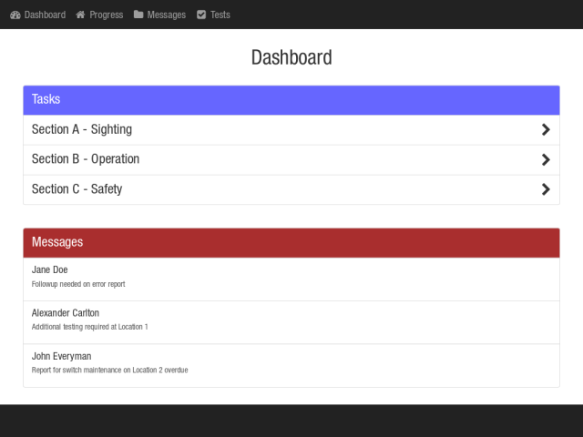
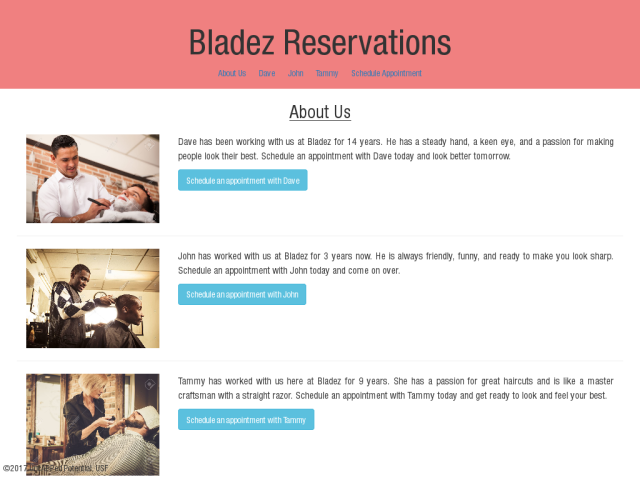
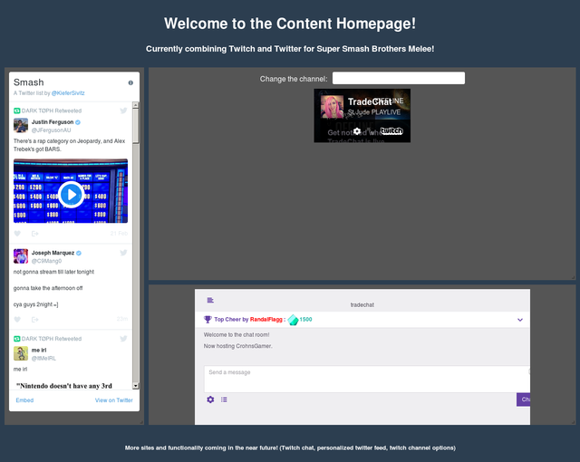

<meta name="description" content="This is my web site made with jekyll on github pages.">
<meta name="author" content="Kiefer">

## Kiefer Sivitz
<div class="top-hero">
    
    <br />
    <span class="skills">Web Developer - SEO Expert - User Experience Designer</span>
</div>






I am a Web Developer and I own a picture of some seagulls

### My Projects

In the past I have worked for the University of South Florida working in VB.net and ASP.net.

After that I was working for a Startup developing an application for field engineers using Angular 1 and NodeJS.

Currently I am working independently accepting jobs doing web development, search engine optimization, and a third thing.

I made this web site using [Jekyll](https://jekyllrb.com/), written in markdown (seen below) rather than HTML and CSS.

This is all placeholder content.

```markdown
Syntax highlighted code block

# Header 1
## Header 2
### Header 3

- Bulleted
- List

1. Numbered
2. List

**Bold** and _Italic_ and `Code` text

[Link](url) and 
```

### Get at me:

If you would like to contact me about work please do so!
